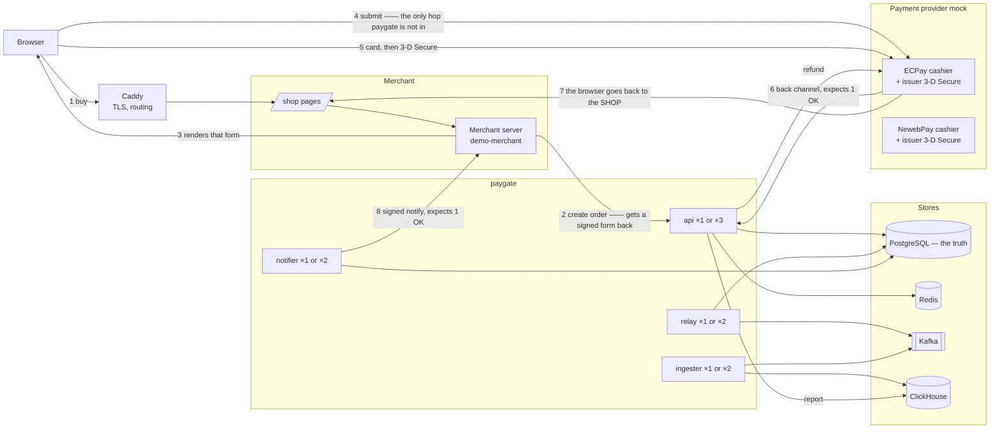
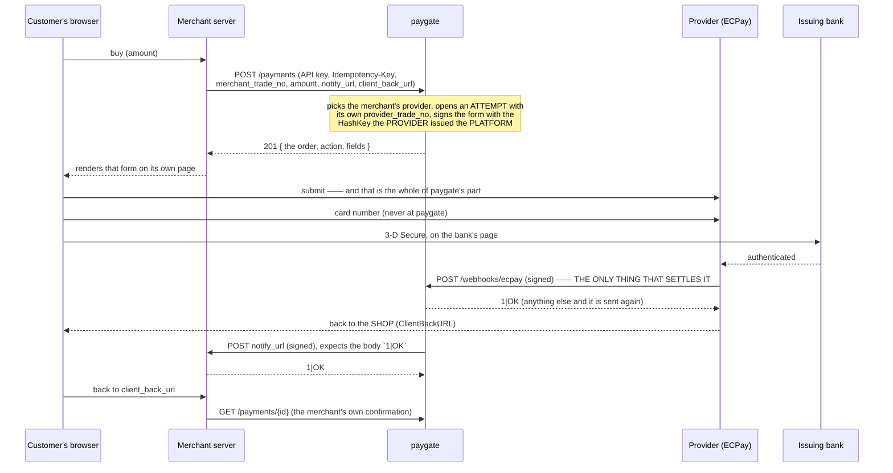
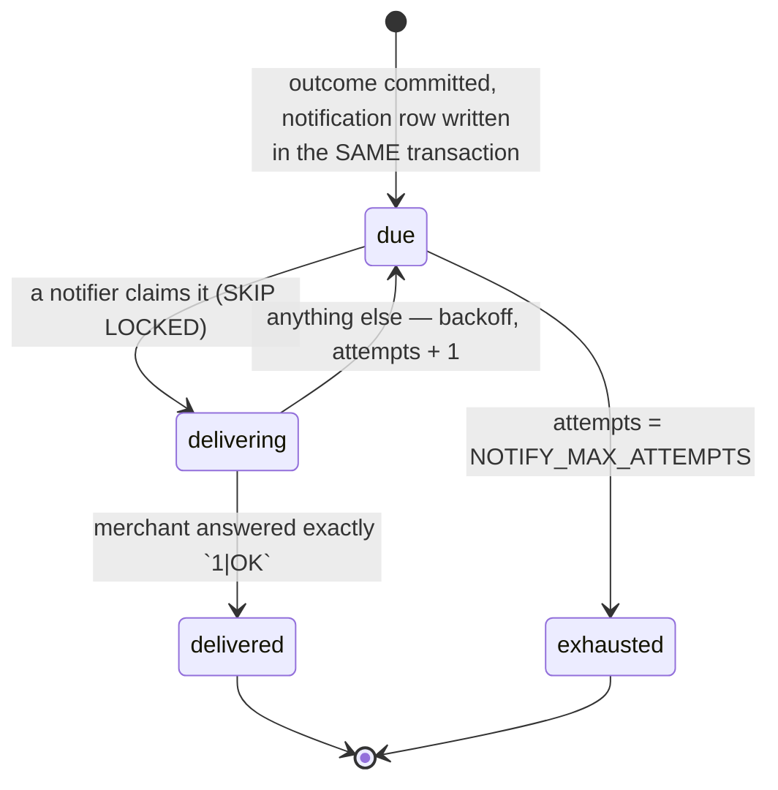
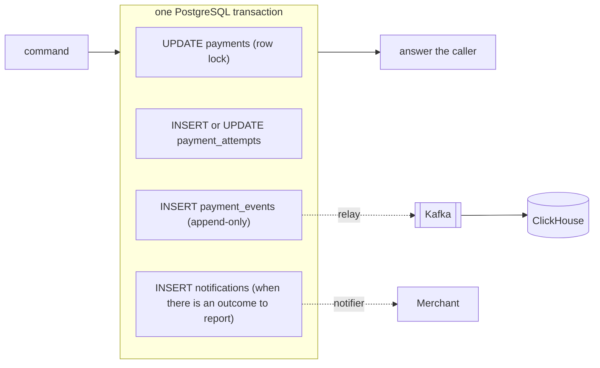
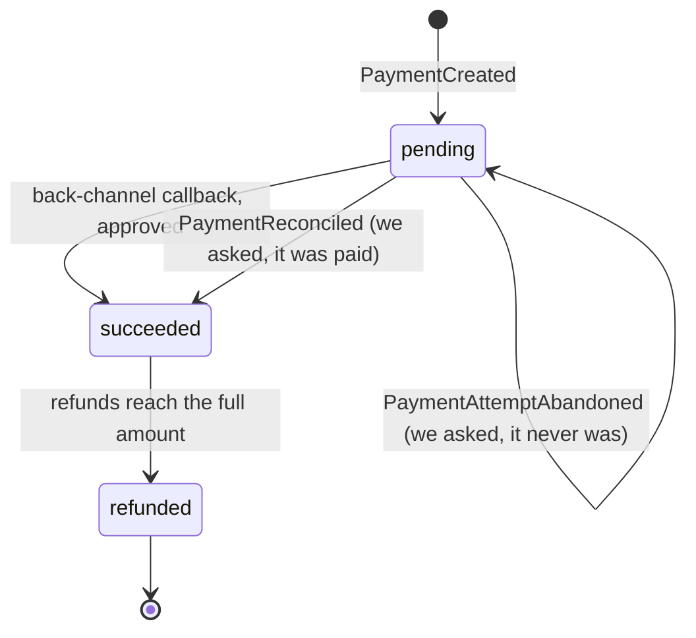

# paygate — System Design

`paygate` is the RealSpec example that is not CRUD. It is a **payment service**
of the kind a platform builds for itself: merchants integrate with paygate, and
paygate integrates with the real gateways — ECPay and NewebPay —
because nobody connects to only one.

Its shape is taken from the real thing rather than imagined. Every rule below
that looks arbitrary is one of ECPay's, and the ones that were surprising came
from reading ECPay's own WooCommerce plugin (`ECPay/Woocommerce_ECPAY`) rather
than from its documentation: that a fresh order number is minted for every
hand-off, that `RtnCode` is an open set, that `SimulatePaid` exists, and that a
gateway which guesses why a callback is late will eventually cancel a payment
somebody made.

That middle position is the whole design. The same ECPay-shaped protocol appears
**twice**, and paygate is on the opposite side of it each time:

| | Below paygate | Above paygate |
|---|---|---|
| Who calls whom | the merchant calls paygate | paygate hands the browser a form for the provider |
| Who signs | paygate signs the result callback | paygate signs the order form |
| Who verifies | the merchant verifies | the **provider** verifies |
| Who must answer `1\|OK` | the merchant, to paygate | **paygate**, to the provider |
| Who may never see a card | the merchant | **paygate** |

So paygate plays the gateway to its merchants and a merchant to its providers,
and every mechanism in this example exists in both directions at once.

### Platform, not merchant of record

paygate is a **platform provider** — one of ECPay's contracted partner platform
providers — and that decides where the money
goes. Each merchant keeps its own account at the provider; paygate holds only
the platform credentials:

| On every request to a provider | Value |
|---|---|
| `MerchantID` | the MERCHANT's own account at that provider |
| `PlatformID` | paygate's platform code |
| `CheckMacValue` | signed with the **platform's** HashKey and HashIV |

That last row is ECPay's rule, not a choice: its documentation is explicit that
when integrating under a platform provider's identity, the `CheckMacValue` must
be produced with the HashKey and HashIV that belong to the `PlatformID`. One key
pair signs for every merchant, and each merchant is settled into its own account.

The alternative — paygate holding one account and collecting everybody's money —
is collecting and paying out on another's behalf, which in Taiwan requires an
electronic payment institution licence. This design does not touch funds at all,
and that is the point of modelling the platform mode rather than the simpler
one.

**The card never enters this system.** The customer types it on the provider's
cashier page, at the provider's origin, after leaving paygate entirely. paygate
has no card field, no Luhn check and no column that could hold a PAN. What it
gets back is a brand and four digits, from the provider's callback.

**Nothing is settled by anything the browser did.** ECPay's documentation is
explicit that the merchant receives no synchronous authorisation result, that
the back channel (`ReturnURL`) is the truth, and that the browser's return
(`OrderResultURL`) is supplementary and in no fixed order. paygate is that
merchant, so the rule binds it: an order becomes `succeeded` when the provider's
back-channel callback arrives and paygate has answered `1|OK`, and in no other
way.

PostgreSQL is the source of truth and it is strongly consistent. Every state
change writes two rows in one transaction — the state, and an append-only audit
row — and that audit table is also the outbox the report pipeline publishes
from.

This file carries **architecture and decisions**. A fact that is executable
lives where it executes and is pointed at from here:

| For | Read |
|-----|------|
| paygate's own API — endpoints, shapes, status codes, and the reason for each | `spec/openapi/openapi.yaml` |
| The providers paygate integrates: cashier, callbacks, refunds, both shapes | `spec/openapi/payment-provider.yaml` |
| The demo merchant's surface, and the callback contract paygate implements | `spec/openapi/demo-merchant.yaml` |
| Behaviour, on both surfaces | `spec/bdd/api/*.feature`, `spec/bdd/e2e/*.feature` |
| The step grammar those features are written in | `spec/bdd/format.yml` |
| Schema | *Data model* below, until `backend/migrations/` exists; from then on the migrations are the owner and this section becomes a pointer |
| Configuration | *Environment variables* below, until `crates/*/src/config.rs` exists; the same rule applies |

The example changes three axes against `minimart-go-nuxt` at once — backend
language (Rust), infrastructure (Redis, Kafka, ClickHouse, two external
providers) and domain — and holds the fourth, the front end, still: Nuxt, the
same locator grammar, the same e2e harness.

---

## System overview

Four binaries are built from one Cargo workspace into one image — `api`,
`worker`, `provider-mock` and `demo-merchant` — and `worker` carries the roles a
container selects by its command:

| Binary | Role | Scales |
|--------|------|--------|
| `api` | Merchant API (orders, their signed forms, refunds), provider callbacks, dashboard, report | horizontally, stateless |
| `worker relay` | Publishes unpublished audit rows to Kafka | horizontally — `FOR UPDATE SKIP LOCKED` |
| `worker ingest` | Consumes Kafka into ClickHouse | up to the partition count |
| `worker notify` | Delivers callbacks to merchants, with retries | horizontally — `FOR UPDATE SKIP LOCKED` |
| `worker reconcile` | Asks the provider about attempts nothing came back for, and re-sends refunds still `pending` | horizontally — `FOR UPDATE SKIP LOCKED`, throttled per attempt |
| `worker rebuild reports` | Operational command: truncate the projection and replay the audit table | runs to completion |
| `provider-mock` | ECPay and NewebPay: cashier, issuer page, callbacks, refund API | one per stack, serving both shapes |
| `demo-merchant` | A merchant: shop API, and the callback receiver | one per stack |

The front end is a static Nuxt SPA, and it serves **paygate's own staff pages
only** — `/login` and `/reports`. It also carries the demo merchant's `/shop`,
`/shop/pay/<merchantTradeNo>` and `/shop/result`, which belong to the merchant
and are kept in the same bundle only because shipping a second static container
would prove nothing.

**paygate has no page a customer ever sees.** The payment form is rendered by the
MERCHANT's page, from what `POST /payments` returned, and the cashier belongs to
the provider. Those two facts are the boundary this whole design is about, and a
browser makes them visible in a way no diagram can. Both locales, `en_US` and
`zh_TW`.

---

## The integration model

### Flow

Count paygate's requests: **one in, two out.** The merchant calls it once; it
calls the merchant back once, and the provider calls it once. That is the whole
conversation, and the customer is not in any of it.

Read the diagram twice and the symmetry is the point. The first two messages are
what a merchant does with paygate; the form and the callback are what paygate does
with a provider. The callback paygate RECEIVES it must acknowledge; the one it
SENDS it demands an acknowledgement for.

### paygate is not on the payment path

Between the form submission and the back-channel callback paygate does nothing at
all. It is not called, it cannot fail, and it cannot be slow. A payment in
progress survives paygate being restarted — and the customer's return does not
touch paygate either, so there is nothing there to break.

The customer has **no conversation with paygate at all**: not a page, not a
token, not an endpoint. This is also why there is no card field anywhere in
`openapi.yaml`. An endpoint that took a card number would put this system in PCI
scope for no benefit, and gateways exist precisely so that it does not have to
be.

`e2e/shop.feature` asserts it from the customer's side: the card is typed at the
provider's origin, no request to paygate or to the merchant carries it, and no
table of paygate's contains it afterwards.

### One order, three numbers

| Number | Whose | Unique where | Reusable |
|--------|-------|--------------|----------|
| `merchant_trade_no` | the merchant's | per merchant, at paygate | no — `422 MERCHANT_TRADE_NO_TAKEN` |
| `payment id` (UUIDv7) | paygate's | globally | it is the identity |
| `provider_trade_no` | paygate's, at the provider | per provider | **never** — a new one per attempt |

The third is the one that surprises people. ECPay refuses a `MerchantTradeNo` it
has seen before, whatever became of it, so paygate cannot send the same number
twice — not for a retry after a decline, not for a reload, not for a different
provider. **Every** hand-off opens a new **attempt** row carrying its own
`provider_trade_no`, and the attempt is what a callback is matched back to. An
order with one decline and one success has two attempts and two provider
numbers, and `payments` still has one row.

Its format is ECPay's plugin's, because the constraint is ECPay's: twenty
characters, mixed alphanumerics only, and unique. `<prefix><8-digit sequence>SN<5
random>` fits, and `PROVIDER_TRADE_NO_PREFIX` is length-checked at startup — the
plugin's own changelog carries the bug that happens otherwise, in an entry that
reads "fixed duplicate order numbers caused by an over-long prefix setting". A
prefix long enough to squeeze out the unique part made two orders share a
number.

An earlier draft of this spec had one live attempt per order, so that a reload
returned the same form. That is safer against double payment and it is not
allowed: the number in that form may already be spent at the provider. The
duplicate is handled after the fact instead — see below.

### When the customer pays twice

A new number per hand-off means a customer who reloads holds two live ways to pay
one order, and sometimes uses both. Both callbacks are true and the money moved
twice; refusing to believe the second does not give it back.

| | |
|---|---|
| The order | settled once, for what it cost. `amount_refunded` is untouched, because that second charge was never this order's money |
| The second callback | acknowledged (refusing it only brings it back), `provider_events.outcome = 'duplicate'`, and a `PaymentDuplicatePaid` audit row naming the attempt that took it |
| The money | refunded automatically, against that attempt's own provider trade number |
| The merchant | told once, about the payment. The duplicate is paygate's problem with the provider, and telling the shop would invite it to ship twice |

ECPay's plugin stops one step short: it flags the order in the admin list with a
red warning and a "mark as handled" button and leaves the refund to a human.
`merchants.duplicate_auto_refund` exists so that behaviour is still reachable
per merchant — some will want to look at it themselves — and
`duplicate_payment.feature` asserts both settings.

**However the second charge is discovered.** A duplicate usually announces itself
with its own callback — but a callback is exactly the thing that goes missing, and
then the only way the charge is ever found is the reconciler asking
(*Reconciling what never came back*). What happens next must not depend on which
of the two got there first: a duplicate found by asking is recorded and refunded
exactly like one a callback announced, subject to the same
`merchants.duplicate_auto_refund`. The refund it queues is `pending` — the same
state a failed automatic refund leaves behind — so it is delivered by the same
machinery described next, in that pass or a later one.

**And when that refund itself fails**, the money must not be left somewhere whose
only record is a log line. The duplicate is recorded before the refund is
attempted, so the fact survives whatever happens next; the refund row stays
`pending`, and the reconciler picks it up on a later pass and sends it again. That
is safe for exactly one reason, and it is the same reason a merchant's own retry
is safe: paygate sends its own refund id as the provider's refund number, so a
refund the provider already performed is recognised rather than repeated
(*Refunds*). It is also why the reconciler is the right place for it rather than a
fourth worker — it exists to chase things nobody answered for, and this is one.

### Choosing a provider

Each merchant is routed to one provider (`merchants.provider_code`), which is
enough to prove the seam: two merchants in the same suite pay through two
providers, and the two adapters sign differently.

| | ECPay | NewebPay |
|---|---|---|
| Hand-off | form POST to `AioCheckOut/V5` | form POST to `mpg_gateway` |
| Parameters | in the clear | packed into `TradeInfo`, AES-256-CBC |
| Signature | `CheckMacValue`, SHA-256 over sorted parameters wrapped in HashKey/HashIV | `TradeSha`, SHA-256 over the encrypted blob wrapped in the same pair |
| Back channel | form-encoded, answered `1\|OK` | form-encoded, answered `1\|OK` |
| Refund | `DoAction` | `close`/`cancel` |

What paygate does with both is identical — open an attempt, sign, hand off,
verify the callback, settle once — which is the point of having two. Routing
across providers on failure is a *non-goal*; the attempt row is the seam where
it would go.

### Telling the merchant

- The body is ECPay's shape — `MerchantID`, `MerchantTradeNo`, `TradeNo`,
  `RtnCode`, `RtnMsg`, `TradeAmt`, `PaymentDate` — plus `CheckMacValue`, a
  SHA-256 over the parameters sorted by name and wrapped in the merchant's
  `HashKey` and `HashIV`. paygate sends its merchants the same shape it is sent,
  one level up.
- **`200` is not enough.** The body must be exactly `1|OK`. A `200 0|ERROR` is
  a failed delivery and is retried — the scenario for that exists because "the
  endpoint answered" and "the merchant accepted" are different facts, and a
  gateway that confuses them loses orders quietly.
- **The retry schedule is ECPay's**: a failed delivery is resent after 5 to 15
  minutes, up to four more times the same day. Those are the defaults
  (`NOTIFY_BACKOFF_MS`, `NOTIFY_MAX_ATTEMPTS`), and the suites override the
  backoff to milliseconds. What is tested is the behaviour — retried, capped,
  then left alone — not the wall-clock, which no test should ever wait for.
- **Not answering is failing.** A merchant that has not replied within
  `NOTIFY_TIMEOUT_MS` is a failed delivery and is retried; so is one that answers
  `3xx`, because the notifier does not follow redirects. A callback is a message
  to a known address, not a link to be chased, and following one would let a
  merchant point paygate at anything.
- Delivery is at-least-once: a merchant that answers slowly may be called
  again. Merchants deduplicate by `MerchantTradeNo`, which they already have.
- Exhaustion is not a failure of the payment. The money moved; only the
  merchant's knowledge of it is missing, and the query endpoint is how it
  recovers. Nothing resends an exhausted notification, and `notify.feature`
  asserts that too — a background job that quietly retried for ever would make
  the attempt cap a lie.
- `notify_url` is a PATH in this example, on the same reverse proxy as everything
  else, and the schema enforces that. So there is no address for a merchant to
  point paygate at and no SSRF surface to defend — which is a property of the
  example, not of the design. A deployment that accepts absolute URLs inherits
  that problem and must resolve and allow-list them; doing so here would add a
  guard with nothing to guard.

### Being told by the provider

The same rules with paygate on the receiving end, which is what makes them
testable from the inside:

- paygate answers the back channel with exactly `1|OK` — **after** committing,
  never before. A callback it could not apply is answered with anything else on
  purpose, so that the provider sends it again.
- Because delivery is at-least-once, the same callback arrives more than once
  and must settle once. `provider_events` has the provider's event id as its primary
  key, and `webhooks.feature` fires four copies at one instant.
- The front channel changes nothing, and paygate is not even on it: the
  `ClientBackURL` it registers is **the merchant's own page**, taken from the
  order. `OrderResultURL`, which would POST a result into the browser, is not
  registered at all — paygate would ignore its contents, and a signed POST into a
  browser only tempts somebody to trust it. So the customer comes back to the
  shop, the shop reads its own record, and if the callback has not arrived yet the
  shop says so (e2e `shop.feature`).
- **`RtnCode` is an open set**, and that is the rule that most repays reading
  the real plugin. `1` is paid; `10100058` and `10200163` are failures;
  `10300066` is "payment result pending confirmation, do not ship yet"; more have been added over the years.
  A code paygate does not know is recorded as `unknown_code`, acknowledged, and
  acted on in no way — the only safe behaviour for a code whose meaning arrives
  later than the code does.
- **`SimulatePaid=1` is not a payment.** ECPay's back office sends it when
  somebody presses "confirm test payment"; it is identical to a real notification
  otherwise. It is recorded, acknowledged, and settles nothing.
- **An amount that is not the order's is refused**, not reconciled away:
  `outcome = 'amount_mismatch'`, no `1|OK`, and an alert. Either the order was
  tampered with on its way to the provider or two systems disagree about the
  price, and settling on either reading is worse than settling nothing. ECPay's
  plugin compares the amount too, but on a mismatch it writes nothing and
  answers nothing — a gap this spec closes deliberately.
- A callback that contradicts a settled order changes nothing and is recorded
  with `outcome = 'conflict'`; a successful one for a different attempt of a
  settled order is `duplicate`, not `conflict`.

### Two kinds of duplicate

| | Question it answers | Mechanism | Answer when it fires |
|---|---|---|---|
| `merchant_trade_no` | "is this the same ORDER?" | `UNIQUE (merchant_id, merchant_trade_no)` | `422 MERCHANT_TRADE_NO_TAKEN` |
| `Idempotency-Key` | "is this the same REQUEST, sent twice?" | `PRIMARY KEY (merchant_id, idempotency_key)` | the stored answer, replayed |

ECPay has only the first; the IETF draft describes only the second. They are not
alternatives: a merchant whose request timed out wants its order back, not an
error, and a merchant whose loop double-submitted wants an error, not a second
order. `orders.feature` asserts both in the same file, two scenarios apart.

A replay is only ever as good as what was stored. If the stored answer cannot be
reproduced faithfully — a status that is no longer a status — paygate answers
`500 INTERNAL` and logs it, rather than guessing at one. A request the merchant
was told had failed must not come back a success the second time it is asked
about.

There is a third duplicate above paygate — the same order handed off twice — and
it is the one that cannot be prevented, only cleaned up. A reload, a back button
or six browsers at one instant each get their own `provider_trade_no`, because
reusing one is what ECPay forbids. So two orders exist at the provider, the
customer may pay both, and the answer is *When the customer pays twice* above:
settle once, record the duplicate, refund it. `handoff.feature` asks twice,
`scaling.feature` races six across three replicas, and
`duplicate_payment.feature` pays twice on purpose.

### Reconciling what never came back

A callback can simply not arrive: the provider sent it and something dropped it,
or paygate answered something other than `1|OK` five times and the provider gave
up. The order is then still `pending`, with an attempt outstanding and nothing
coming.

**paygate does not decide what happened.** It asks, with `QueryTradeInfo`, and
acts only on the answer:

| `TradeStatus` | Means | paygate does |
|---|---|---|
| `1` | paid | settles it, late: `PaymentReconciled` with `source = 'query'`, and the merchant's notification |
| `10200095` | the consumer never completed it | ends the attempt: `PaymentAttemptAbandoned`, order back to `pending`, merchant told nothing |
| `0` | created, still unpaid | nothing, and asks again later |

This is ECPay's documented recovery path — its documentation says "if the
authorisation result notification is not received because too much time has
passed, use the query order API to check, then display the payment result" —
and it is what its plugin does: wait an hour
on a credit card, then query, and cancel **only** on `10200095`.

**An answer is only an answer if it verifies.** The query is the same trust
boundary as the callback, pointing the other way, and a reconciler that believed
whatever came back would hand anyone who can reach that address a way to settle
other people's orders. A forged answer, and a `403` from a provider that has had
enough of being asked, are both worth exactly what no answer is worth: the
attempt stays outstanding and is asked about later. `reconcile.feature` asserts
both, and asserts that a refusal still counts as an asking — otherwise the next
pass would queue up another `403` and extend the blackout.

Three details that are the design rather than decoration:

- **Wait first.** `RECONCILE_AFTER_MINUTES` (60) exists because a customer who
  has been at the bank for ten minutes has not failed. Querying everything in
  flight would also earn `403` and thirty minutes of silence, which ECPay's
  integration notes promise for calling non-order APIs too fast.
- **`TimeStamp` is valid for three minutes**, so a host with a wrong clock cannot
  query at all. Clock synchronisation is a requirement, not an operational nicety.
- **The answer is not JSON.** It is a signed `key=value&…` string, and paygate
  verifies it before believing it — the same verification as the callback, on a
  different transport.

It has a second job for the same reason. A refund that is still `pending` because
the provider did not answer, or answered `5xx`, is sent again on a later pass —
including the automatic refund of a duplicate payment. Both jobs are the same
sentence ("ask the provider about something nobody answered for"), and both are
safe to repeat because the provider deduplicates on the number paygate chose.

The reconciler is therefore the second way an order can be settled, and the only
way one can be given up. It and the callback race by design, and both go through
the same conditional update, so the loser finds nothing to do and says so
(`provider_events.outcome = 'no_op'`).

### Refunds

`POST /payments/{id}/refunds` takes an `amount`, as ECPay's `DoAction` takes a
`TotalAmount`, and may be called more than once until the total is reached. The
rule — the refunds of one payment never exceed what was charged — is enforced by
the row lock, by `CHECK (amount_refunded BETWEEN 0 AND amount)`, and by the races
in `refunds.feature` and `scaling.feature`.

A refund is the one call paygate makes to a provider and waits for, so it is the
one place a provider's silence is paygate's problem:

- paygate sends its own refund id as the provider's refund number, so the
  provider deduplicates a retry. A refund whose answer was lost is safe to send
  again, and `refunds.feature` sends it again and asserts one refund.
- A provider `5xx` is `502 PROVIDER_UNAVAILABLE` and nothing changes.
- No answer within `PSP_TIMEOUT_MS` is also `502`, the refund row stays
  `pending`, and `amount_refunded` is not moved. The idempotency key is *not*
  consumed, so the merchant's retry reaches the provider, which deduplicates.
- A retry that no longer fits is told how much is left, not merely refused. The
  reservation the timed-out refund made was rolled back, so a *different* refund
  can take the remainder in between and the resumed retry can no longer be
  honoured. It answers `422 REFUND_EXCEEDS_REMAINING` with the amount that
  remains — the same answer a fresh request of that size would get — and never
  `PAYMENT_NOT_REFUNDABLE`, which would be a lie: the payment is refundable,
  this amount is not.

---

## State and the audit log

### Two tables, one transaction

Writing them together is what makes three problems go away: the audit trail
cannot drift from the state, the report's input cannot be lost, and a paid order
cannot end up with nobody owing the merchant a callback.

For a provider callback the transaction is the whole of it — verify, insert the
`provider_events` row, settle the payment, close the attempt, append the audit row,
write the notification — and only when it commits does paygate answer `1|OK`.

### Events

| Event | Written when | Projected to the report |
|-------|--------------|-------------------------|
| `PaymentCreated` | the merchant creates the order | no — an intention, not an outcome |
| `PaymentAttemptStarted` | an attempt is opened and the customer is handed to a provider | no — it records that the order left `pending`, and to whom |
| `PaymentAttemptFailed` | the callback said declined, or 3-D Secure was not passed; the order returns to `pending` | yes, as a failed attempt |
| `PaymentSucceeded` | the callback said approved | yes |
| `PaymentAttemptAbandoned` | the PROVIDER said the consumer never completed it (`TradeStatus=10200095`); the order returns to `pending` | no — the absence of an outcome |
| `PaymentReconciled` | a payment found by asking rather than by being told; `payload.source = 'query'` | yes — it is a payment |
| `PaymentDuplicatePaid` | a second attempt of a settled order also paid | yes — money really moved |
| `ProviderCallTimedOut` | a refund call did not answer within `PSP_TIMEOUT_MS` | no — the state did not change, but the reason is recorded rather than lost |
| `PaymentRefunded` | a refund committed | yes |

The report's success rate is therefore over ATTEMPTS, which is what a gateway's
authorisation rate means: a customer who fails once and succeeds on the second
card is one success and one failure, not one success.

There are only three states, and neither `processing` nor `failed` is one of
them. paygate cannot know whether a customer is at the provider typing a card or
has closed the tab, so an order with forms outstanding is still `pending`; what
is outstanding is on the ATTEMPT, where it is a fact rather than a guess. A card
that is refused is a failed attempt, and the order is payable again; an order that is never paid simply
expires when the provider says nobody ever completed it, and `GET /payments/{id}`
keeps reporting `pending` with its last attempt `abandoned`. That asymmetry is
deliberate:
"this order was not paid" is the absence of an outcome, not an outcome.

`succeeded` is final. A later callback that contradicts it changes nothing.

### Concurrency

Every command that changes a payment takes `SELECT … FOR UPDATE` on its row and
decides against what it read under that lock. Contenders queue rather than
retry. The rules are repeated in the schema so that a path which forgot the lock
fails instead of corrupting:

| Rule | Lock | Schema |
|------|------|--------|
| Two forms never share a provider number | the create command | `UNIQUE (provider_code, provider_trade_no)` |
| An order is settled at most once | the callback handler | `UPDATE … WHERE status = 'pending'` |
| A provider callback applies once | the callback handler | `provider_events` primary key |
| A callback and a reconciliation never both settle | both paths | `UPDATE … WHERE status = 'pending'` |
| Refunds never exceed the charge | the refund command | `CHECK (amount_refunded BETWEEN 0 AND amount)` |
| One idempotency key answers once | the idempotency record | `PRIMARY KEY (merchant_id, idempotency_key)` |
| One order per merchant trade number | the create command | `UNIQUE (merchant_id, merchant_trade_no)` |
| One payment's two rows are locked parent first | every command that takes both | `payments` before `payment_attempts`, everywhere |
| A reconciliation pass never deadlocks against a refund or a callback | the reconciler's claim | the claim is `FOR UPDATE` on `payments`, `SKIP LOCKED` |

Two of those rows belong to the same payment — its `payments` row and the
`payment_attempts` row under it — and more than one command needs both, so the
order they are taken in is part of the design rather than an implementation
detail: **`payments` first, always, then `payment_attempts`.** A command that
starts from the attempt — a callback arrives naming a provider trade number, not
an order — reads its `payment_id` without a lock first, which is sound because an
attempt never moves to another payment, and then locks parent before child. Two
paths that take the same two rows in two different orders deadlock: PostgreSQL
detects it and kills one of them with `40P01`, which reaches the outside world as
a random `500` on a merchant's refund, or as a callback the provider goes on
resending because it was never acknowledged. Retrying does not make that correct.
The order does.

The reconciler is where this is easiest to get wrong, so the rule is stated for it
directly: its batch claim takes `FOR UPDATE … SKIP LOCKED` on **`payments`**,
never on `payment_attempts`. That claim is held across a round trip to the
provider for every attempt in the batch, so whichever table it locks first fixes
the acquisition order for the whole pass, whatever the functions it calls later
do internally. Claiming on `payments` also excludes more rather than less: two
reconciler replicas can no longer take two different attempts of one payment at
the same time, and a candidate whose payment is busy is skipped this pass instead
of waiting behind it.

---

## The report's projection

ClickHouse holds `report_events`: one wide row per reportable event, built by
the ingester from Kafka. It is the only eventually consistent thing in the
system, and the daily report is the only endpoint that reads it.

- **Wide** because the events already carry `card_brand`, `failure_code`,
  `provider_code` and `currency`, so the width is free and the report can answer
  "which decline codes, at which provider" without joining PostgreSQL.
- **No materialised rollup**: a ClickHouse MV fires before deduplication and
  would count duplicates the pipeline is allowed to produce. Reports read
  `report_events FINAL`.
- **Order does not matter**: every row is independent and the report
  aggregates.
- **Duplicates do**: `ReplacingMergeTree(ingested_at)` keyed on `event_id`.
- **Rebuildable**: `worker rebuild reports` truncates and replays
  `payment_events` from PostgreSQL — not Kafka, whose retention is a setting
  rather than a record.
- **Never skips**: an event the ingester cannot apply stops it, with an alert
  and without committing the offset.

---

## The payment provider mock

The providers are external; the mock is their stand-in, started per scenario,
serving both shapes from one process under `/provider/ecpay/…` and
`/provider/newebpay/…`. It is a real counterparty, not a stub: it **verifies
paygate's signature** and refuses what does not check out, which is how the
features assert that paygate signs correctly without a digest ever appearing in
a spec file.

Its cashier behaves according to the card number, the way real providers publish
test cards, so a scenario states the provider's behaviour in its own step:

| Card typed at the provider | 3-D Secure | Callback queued behind authentication |
|-------------|------------|---------------------------------------|
| `4242424242424242`, and any other Luhn-valid number | required | `charge.succeeded` |
| `4000000000000002` | required | `charge.failed`, `card_declined` |
| `4000000000009995` | required | `charge.failed`, `insufficient_funds` |
| `4000000000003063` | required | `charge.failed`, `three_ds_failed` |
| `4242424242424241` | refused by the provider's own card validation, before the issuer | none |

The issuer page offers both outcomes — authenticate, or fail — so a browser can
take either path with the same card; the card number chooses what the provider
then says.

Refunds are synchronous, and the amount chooses the answer:

| Refund amount | The provider |
|---------------|--------------|
| any | succeeds, and deduplicates on paygate's refund number |
| `777` | succeeds after 800 ms — which holds the winner of the idempotency race inside the call while the losers arrive |
| `119` | answers `503` |
| `408` | never answers, **and refunds it anyway** — the lost-answer case |

It also answers `QueryTradeInfo`, which is the whole of the reconciler's world:
a scenario arms the next answer (`0`, `1` or `10200095`), and the mock records
every query so that "paygate asked" — and more often "paygate did NOT ask yet" —
is assertable. Query it too fast and it answers `403` and stops answering for a
while, as the real one does.

`888` is the amount whose provider is SLOW about the whole order: its query is
answered after 800 ms, and its callback is delivered 300 ms after it is
released. The reconciler holds its batch claim for as long as the provider takes
to answer, so a scenario that needs a pass to be still in flight while a
callback for the same attempt arrives says so with the ORDER'S OWN AMOUNT rather
than with a word invented for it — and the shorter callback delay is what puts
the callback INSIDE that window instead of leaving which of the two gets there
first to chance. It is not `777`, the refund side's slow amount: an order of 777
would have a slow refund as well, and one scenario rarely wants both.

Four things it can do to a callback besides reporting it honestly, because all
four happen: sign it with a key it was never issued (`forged`), set
`SimulatePaid=1`, send an amount that is not the order's, or send any `RtnCode`
at all. Each is a variant of one step, and each has exactly one right answer
from paygate.

A queued callback is released by exactly two things: the customer authenticating
on the mock issuer's page (which is what happens on the e2e surface), or the
harness asking for it (which is the API surface playing the customer, because
there is no browser there). Both go through a control surface under `/__control`
that exists only on the mock — paygate carries no test-only code.

The merchant's behaviour is stated the same way, by the `notify_url` the order
names: `/notify` answers `1|OK`, `/notify-strict` verifies the signature first,
`/notify-flaky` fails twice, `/notify-reject` always fails, `/notify-mumble`
answers `200` with the wrong body, `/notify-loose` answers `1|OK` with a newline
after it, and `/notify-slow` answers correctly but after `NOTIFY_TIMEOUT_MS`. The
last two are there because "the body starts with `1|OK`" and "the body IS `1|OK`"
are different comparisons, and because an answer that arrives too late is not an
answer.

---

## Data model

### PostgreSQL

| Table | Columns | Constraints and why |
|-------|---------|---------------------|
| `payments` | `id` uuid PK (UUIDv7, the trade number paygate gives the merchant) · `merchant_id` · `merchant_trade_no` · `amount` · `currency` · `status` · `item_desc` · `card_brand` null · `card_last4` null · `notify_url` · `client_back_url` · `amount_refunded` default 0 · `created_at` · `updated_at` | `UNIQUE (merchant_id, merchant_trade_no)`; `CHECK (amount BETWEEN 1 AND 99999999)`; `CHECK (status IN ('pending','succeeded','refunded'))` — there is no `processing`, because paygate cannot know whether anybody is paying; the attempt says that; `CHECK (amount_refunded BETWEEN 0 AND amount)`; index `(merchant_id, created_at DESC)` |
| `payment_attempts` | `id` uuid PK · `payment_id` · `provider_code` · `provider_trade_no` · `status` · `rtn_code` int null · `simulate_paid` bool default false · `failure_code` null · `provider_charge_id` null · `card_brand` null · `card_last4` null · `eci` null · `auth_code` null · `started_at` · `queried_at` null · `settled_at` null | `UNIQUE (provider_code, provider_trade_no)` — never reused, ever; `CHECK (provider_trade_no ~ '^[A-Za-z0-9]{1,20}$')` because that is ECPay's rule and a wrong one is rejected at the cashier, not here; `CHECK (status IN ('redirected','succeeded','failed','abandoned'))`; partial index `(started_at) WHERE status = 'redirected'` is the reconciler's queue |
| `payment_events` | `id` bigserial PK · `event_id` uuid · `payment_id` · `merchant_id` · `seq` int · `event_type` · `payload` jsonb · `occurred_at` · `published_at` null · `publish_count` default 0 | `UNIQUE (event_id)`; `UNIQUE (payment_id, seq)`; append-only except the two publish columns; partial index `(id) WHERE published_at IS NULL` is the relay's queue |
| `refunds` | `id` uuid PK (also the number sent to the provider) · `payment_id` · `attempt_id` · `merchant_id` · `amount` · `status` · `reason` null · `provider_refund_id` null · `created_at` | `CHECK (amount > 0)`; `CHECK (status IN ('pending','succeeded'))`; index `(payment_id)` |
| `notifications` | `id` bigserial PK · `payment_id` · `merchant_id` · `url` · `payload` jsonb · `attempts` default 0 · `next_attempt_at` · `delivered_at` null · `exhausted_at` null · `last_status` int null · `last_body` text null · `created_at` | partial index `(next_attempt_at) WHERE delivered_at IS NULL AND exhausted_at IS NULL` is the notifier's queue |
| `provider_events` | `provider_code` · `event_id` text · `payment_id` · `attempt_id` · `rtn_code` · `outcome` · `raw` jsonb · `received_at` | PK `(provider_code, event_id)` is the callback deduplication; `CHECK (outcome IN ('applied','no_op','conflict','duplicate','amount_mismatch','unknown_code'))` — one row per thing that arrived, whatever it turned out to be |
| `provider_queries` | `id` bigserial PK · `attempt_id` · `asked_at` · `trade_status` · `raw` text | what the reconciler asked and what it was told. It is how "paygate did not guess" becomes a fact somebody can check |
| `providers` | `code` PK (`ecpay`, `newebpay`) · `platform_id` · `hash_key` · `hash_iv` · `cashier_url` · `query_url` · `refund_url` | paygate's **platform** credentials. This pair signs for every merchant, which is ECPay's platform rule; seeded per scenario, and the mock is given the same pair |
| `merchants` | `id` PK · `name` · `currency` · `timezone` · `provider_code` NOT NULL · `provider_merchant_id` NOT NULL · `duplicate_auto_refund` default true · `rate_limit_per_minute` · `hash_key` · `hash_iv` | `provider_merchant_id` is this merchant's OWN account at that provider — where its money lands. Both it and `provider_code` are NOT NULL on purpose: a merchant that cannot be paid is not a merchant here, so onboarding writes this row only once the provider account exists, and there is no half-configured state for an endpoint to have to answer for. The hash pair here signs what paygate sends THIS merchant, and is unrelated to the provider's |
| `api_keys` | `id` PK · `merchant_id` · `key_hash` char(64) · `key_prefix` · `revoked_at` null | `UNIQUE (key_hash)`; raw keys are never stored |
| `dashboard_users` | `id` PK · `merchant_id` · `email` · `password_hash` | `UNIQUE (email)` |
| `idempotency_keys` | `merchant_id` · `idempotency_key` · `request_fingerprint` · `state` · `response_status` null · `response_body` jsonb null · `created_at` · `expires_at` | PK `(merchant_id, idempotency_key)` |
| `projection_checkpoints` | `projection` PK · `last_event_id` · `last_position` · `updated_at` | read by a rebuild and at startup |

No table has a column that could hold a card number or a CVC, and no code path
could fill one — `orders.feature` asserts that against `information_schema`.

### Kafka

Topic `paygate.payment-events.v1`, 3 partitions, created by the **relay** at startup —
idempotently, tolerating a topic that is already there, so any number of replicas may start at
once. Broker-side auto-creation is off, because a topic that appears with whatever
`num.partitions` happened to be set to is not a schema. The ingester reports itself unready until
the topic exists and it holds an assignment. Key: `payment_id`. Value: the audit row.

### ClickHouse

`report_events`: `event_id` UUID · `seq` UInt32 · `merchant_id` UInt64 ·
`payment_id` UUID · `event_type` LowCardinality(String) · `provider_code`
LowCardinality(String) · `amount` Int64 · `currency` · `card_brand` ·
`failure_code` · `reference` String · `refund_id` UUID · `occurred_at`
DateTime64(3, 'UTC') · `ingested_at` · `ingester_id`.
`ENGINE = ReplacingMergeTree(ingested_at) PARTITION BY toYYYYMM(occurred_at)
ORDER BY (merchant_id, event_id)`.

### Redis — nothing that matters

Sessions, the API key cache, the idempotency lock and answer cache, the rate
limiter's buckets. No persistence.

Losing it costs sessions, and one thing more that is worth saying out loud: the
rate limiter's buckets come back **full**. A merchant that was being refused a
second ago is let straight through, so a restart is a burst — which is the
correct trade against refusing real customers, and is asserted rather than
assumed (`resilience.feature`). Everything else Redis holds has an answer in
PostgreSQL, including an idempotency key whose first answer was cached in Redis
and whose retry arrives after Redis is gone.

---

## Authentication

| Credential | Direction | Carried as | Verified how |
|------------|-----------|------------|--------------|
| API key | merchant → paygate | `Authorization: Bearer sk_test_…` | SHA-256 → Redis cache → PostgreSQL; revocation clears the cache |
| Signature on the hand-off | paygate → provider | `CheckMacValue`, or `TradeSha` over the AES blob | the **provider** recomputes it with the pair it issued the PLATFORM, and refuses anything else |
| Signature on the callback | provider → paygate | a field of the form body | paygate recomputes it with the same pair; a bad one is `400` and nothing is applied |
| Signature on the notification | paygate → merchant | `CheckMacValue` in the body | the merchant recomputes it; `/notify-strict` is a merchant that does |
| Dashboard session | staff → paygate | HttpOnly `session` cookie | random token, stored in Redis under its SHA-256, deleted on logout |

Each endpoint accepts exactly one kind, and the features present the wrong one
on purpose.

`CheckMacValue` is not "SHA-256 over the sorted parameters" and a gateway built
on that sentence never connects. ECPay's algorithm, as its own SDK implements it:

1. sort the parameters by name, join with `&`
2. wrap: `HashKey=…&<sorted>&HashIV=…`
3. URL-encode, then **lowercase the whole string**
4. put seven characters back the way .NET leaves them:
   `%2d`→`-`, `%5f`→`_`, `%2e`→`.`, `%21`→`!`, `%2a`→`*`, `%28`→`(`, `%29`→`)`
5. SHA-256, then uppercase

Step 4 is the one everybody loses a day to, and it is why the algorithm is
pinned to a known vector in the unit tests rather than described in prose.

Nowhere in this repository is a digest written down. Every signature is checked
by the party that would check it in production — the provider mock for what
paygate sends up, paygate for what comes back down, `/notify-strict` for what
goes down to the merchant — so a scenario asserts "signed correctly" by
asserting that the counterparty accepted it. The harness's only cryptographic
job is the opposite one: `the payment form is submitted to the payment provider,
tampered after signing` changes the amount after paygate signed it and demands
that the provider refuse.

The one deliberate deviation from ECPay and NewebPay is below paygate, not above it:
their merchant APIs authenticate queries and refunds with a check value, and
paygate's uses a bearer API key. Above paygate — where this example's subject
matter is — the protocol is theirs.

### Credentials in this repository

This example is a whole working system, so it necessarily contains values that
are shaped like credentials: the pair a request is signed with, the key a
fixture seeds, the password a browser test types. **None of them authenticate
against anything that exists**, and the code never holds one: every secret a
running service needs is read from the environment at startup, with no default
and no fallback (`crates/infra/src/config.rs` — `required("MERCHANT_HASH_KEY")`
and its siblings), and what the database stores is a SHA-256 of an API key or a
bcrypt of a password, never the thing itself.

| What | Where it comes from |
|---|---|
| `3002607` / `pwFHCqoQZGmho4w6` / `EkRm7iFT261dpevs`, and the test merchant `2000132` | **ECPay's own published sandbox credentials**, printed in ECPay's official WooCommerce plugin README. Every developer integrating with ECPay uses this same pair against the same public sandbox. They are also not optional: `CheckMacValue` is verified against ECPay's documented sample vector, and a different key would make that test prove nothing |
| The NewebPay pair, and every merchant's `hash_key` / `hash_iv` | Invented. NewebPay publishes no sandbox pair; the merchant ones spell out what they are (`acmehashkey0123456789abcdef01234`) |
| `sk_test_…` API keys | Fixtures. A key is in plaintext for one reason — a request has to carry a credential for the test to be a test — and `api_keys.feature` asserts that only its SHA-256 is stored |
| `secret123` and its bcrypt hashes | The fixture login for the dashboard tests |

One of those deserves a note rather than a row. The tail of
`sk_test_acme_4eC39HqLyjWDarjtT1zdp7dc` is **the sample secret key from
Stripe's own documentation** — inert, and belonging to a company this project
has nothing to do with. It is the one value here a reader could mistake for a
real leak. It was left alone deliberately: changing it means recomputing every
seeded `key_hash` across eighteen feature files, for a string that authenticates
nothing. A new fixture should not copy its shape.

`.gitleaks.toml` at the root of the repository forgives each of these **by
value**, one at a time, and never by file — a path-based allowlist would stop
looking at exactly the files most likely to grow a real secret later. CI runs
that scan on every pull request, so adding a fixture credential means adding it
to that config, in a diff somebody reviews. The one real private key in the
example, the localhost TLS certificate, is generated per machine by
`local/certs/generate.sh` and is not committed at all.

---

## Failure model

| Down | Orders | Hand-off | Payments in flight | Merchant callbacks | Reports | Proved by |
|------|--------|----------|--------------------|--------------------|---------|-----------|
| Redis | created; idempotency from PostgreSQL; rate limit fails **open** | works | unaffected | work | work | `resilience.feature` |
| A provider's cashier | created | the form is still returned — paygate does not call the provider to produce it | the customer cannot pay; the order stays `pending` | — | work | not a scenario on the API surface: paygate is not in that path |
| A provider's refund API (`5xx`) | work | works | unaffected | work | work | `refunds.feature` |
| A provider's refund API (silent) | work | works | unaffected | work | work | `refunds.feature` — `502`, refund left `pending`, retry deduplicated |
| The provider's callback never arrives | work | works | the reconciler asks after `RECONCILE_AFTER_MINUTES` and applies whatever the provider says | sent if it turns out to have been paid | work | `reconcile.feature` |
| A provider's `QueryTradeInfo` (403, too fast) | work | works | nothing is decided; asked again later | — | work | `reconcile.feature` throttling; the mock answers 403 |
| paygate, restarted mid-payment | refused while down | refused while down | **unaffected** — the provider resends the callback | delivered afterwards | work | `webhooks.feature` — `resilience.feature` is about Redis only |
| notifier | work | works | unaffected | queue; delivered when it returns | work | `notify.feature` |
| Merchant's endpoint | work | works | unaffected | retried to `NOTIFY_MAX_ATTEMPTS`, then exhausted and logged | work | `notify.feature` |
| relay | work | works | unaffected | work | stale | `reports.feature` |
| ingester | work | works | unaffected | work | stale | `reports.feature` |
| ClickHouse | work | works | unaffected | work | `503 REPORTING_UNAVAILABLE` | `reports.feature` |
| PostgreSQL | refused | refused | callbacks refused, and therefore resent | stalled | refused | not a scenario: no promise beyond refusal |

The row worth reading twice is paygate's own. Because it is not on the payment
path, and because the provider resends anything it did not get `1|OK` for,
paygate can be restarted in the middle of a payment without losing it.

---

## Scaling

- **api** is stateless; any replica serves any request, callbacks included.
- **relay**, **notifier** scale out by `SKIP LOCKED`; **ingester** to the
  partition count.
- **PostgreSQL** is the vertical bottleneck by design: it arbitrates every
  race. Per paid order: three short transactions — create, hand off, settle —
  with the notification row written inside the third.
- A provider callback can land on any replica, and `scaling.feature` sends six
  copies of one to three of them.

### Where this design stops scaling

- One PostgreSQL primary. Beyond it: shard by `merchant_id`, which every table
  already carries.
- The relay is a single logical queue per row; at very high rates it becomes
  CDC (logical replication) instead of `published_at` marking.
- The notifier's per-row claim is fine to thousands per second and no further.
- ClickHouse `FINAL` at read time costs; beyond a few million rows a day the
  report reads a rollup written by a deduplicating job rather than a view.

---

## Alternatives considered

**paygate hosts the cashier itself** — that is, paygate IS ECPay: it receives the
card and calls an acquirer. Two earlier drafts of this spec did that, once with
a JSON create API and once with a signed form entry. It was wrong for this
example twice over: it puts a card, and therefore PCI scope, inside the system
under design, and it turns the "external payment service" into an acquirer stub
instead of the counterparty whose protocol has to be implemented. A platform's
payment service integrates gateways; it does not become one.

**One live attempt per order**, so that a reload returns the same form and a
customer cannot pay twice. It was in an earlier draft of this spec and it is not
allowed: the number in that form may already be spent at the provider, and ECPay
refuses an order number it has seen before whatever became of it. Its own plugin
mints a new one per hand-off for exactly this reason, and pays for it with a
duplicate-payment warning in the admin. paygate pays for it with an automatic
refund instead.

**A Stripe-style client secret** (create an intent, confirm from the browser
with a hosted-fields SDK). The same separation, and what a single-provider
integration would use. The ECPay/NewebPay redirect model was chosen because it is
what a Taiwanese platform actually integrates, and because the redirect is what
makes the two-level symmetry visible.

**Event sourcing with asynchronous projections.** Rejected: for a payment with a
handful of events it costs a projector, a second copy of the state, ~30% more
writes per order, and a merchant API that can `404` an order it just created.
The audit table keeps what was actually valuable — history that cannot drift,
and a rebuildable projection.

**Redis + Kafka, accept and answer 202** on the merchant's create call.
Rejected: creating an order is one small transaction, and the merchant is
waiting to send a customer somewhere with the answer.

**Routing across providers on failure** (try NewebPay when ECPay declines). Left
undone deliberately: the attempt row already carries `provider_code`, so it is a
policy on top of a model that supports it, and it would double the scenario
count without adding a mechanism.

---

## Non-functional requirements

| Id | Requirement | Proved by |
|----|-------------|-----------|
| NFR-PCI-1 | No card data ever reaches paygate or the merchant | BDD: `orders.feature` (no column could hold one), e2e `shop.feature` (the card goes only to the provider's origin) |
| NFR-PCI-2 | paygate stores brand and last four only, and only from a callback | BDD: `handoff.feature` |
| NFR-IDEM-1 | One idempotency key changes money at most once | BDD: `idempotency.feature`, `resilience.feature` |
| NFR-IDEM-2 | One merchant trade number is one order | BDD: `orders.feature` |
| NFR-IDEM-3 | One provider order number is used once, ever, and fits 20 alphanumerics | BDD: `handoff.feature`, `scaling.feature`; unit: the generator |
| NFR-IDEM-4 | A stored answer that cannot be replayed faithfully is a failure, never a success | BDD: `idempotency.feature` |
| NFR-CONC-1 | An order is settled once, whichever of a callback and a reconciliation gets there first | BDD: `webhooks.feature`, `reconcile.feature`, `scaling.feature` |
| NFR-CONC-2 | Refunds never exceed the charge | BDD: `refunds.feature`, `scaling.feature`; schema |
| NFR-REFUND-1 | A refund that cannot be honoured says how much is left, whether it is a new request or a resumed one | BDD: `refunds.feature` |
| NFR-CONC-3 | A provider callback applies at most once | BDD: `webhooks.feature`, `scaling.feature` |
| NFR-CONC-4 | Rate limits hold under concurrency | BDD: `rate_limits.feature` |
| NFR-CONC-5 | A refund and a provider callback for one payment never deadlock against each other | BDD: `reconcile.feature` (both at one instant); unit: `infra` — driven until PostgreSQL would have raised `40P01` |
| NFR-CONC-6 | A reconciliation pass never deadlocks against a callback for the attempt it claimed, however long the provider takes to answer | BDD: `reconcile.feature` (a pass and the duplicate's callback at one instant, on the slow amount); unit: `infra` |
| NFR-SIG-1 | What paygate hands the provider verifies against the provider's key | BDD: `handoff.feature` — the mock accepts it, and refuses a tampered copy |
| NFR-SIG-2 | A callback not signed by the provider changes nothing | BDD: `webhooks.feature` |
| NFR-SIG-3 | What paygate sends the merchant verifies against the merchant's key | BDD: `notify.feature` (`/notify-strict`) |
| NFR-ACK-1 | paygate answers `1\|OK` only after committing, and anything else gets the callback resent | BDD: `webhooks.feature` |
| NFR-ACK-2 | A callback paygate cannot interpret is acknowledged and acted on in no way | BDD: `webhooks.feature` (unknown `RtnCode`, `SimulatePaid`) |
| NFR-ACK-3 | A callback whose amount is not the order's settles nothing and is not acknowledged | BDD: `webhooks.feature` |
| NFR-RECON-1 | An attempt is ended only on the provider's word, never on a local timer | BDD: `reconcile.feature` |
| NFR-RECON-2 | A payment whose callback was lost is still found, and the merchant still told | BDD: `reconcile.feature` |
| NFR-RECON-3 | An answer from a provider is verified before it is acted on, in both directions | BDD: `reconcile.feature` (forged query answer), `webhooks.feature` (forged callback) |
| NFR-DUP-1 | A second payment for one order is settled once, recorded, and refunded | BDD: `duplicate_payment.feature` |
| NFR-DUP-2 | A duplicate refund that failed at the provider is retried, not abandoned | BDD: `duplicate_payment.feature` |
| NFR-DUP-3 | A duplicate found by asking is refunded exactly like one a callback announced | BDD: `duplicate_payment.feature` |
| NFR-PLAT-1 | Every request to a provider carries the merchant's own account and the platform's signature; paygate never holds funds | BDD: `handoff.feature`; unit: the signer |
| NFR-NOTIFY-1 | Every outcome is owed to the merchant, written with it | BDD: `webhooks.feature`, `notify.feature` |
| NFR-NOTIFY-2 | Delivery is retried until `1\|OK`, to a stated limit | BDD: `notify.feature` |
| NFR-NOTIFY-3 | Two notifiers deliver once, not twice | BDD: `scaling.feature` |
| NFR-AUDIT-1 | Every state change has an audit row, in its transaction | BDD: everywhere |
| NFR-PROJ-1 | The projection can be destroyed and rebuilt identically | BDD: `reports.feature`, e2e `reports.feature` |
| NFR-PROJ-2 | An event is projected once | BDD: `reports.feature` |
| NFR-READ-1 | Merchant reads are strongly consistent | BDD: `orders.feature`, `scaling.feature` |
| NFR-SCALE-1 | Any API replica is interchangeable, callbacks included | BDD: `scaling.feature` |
| NFR-SCALE-2 | Workers scale out without loss or duplication | BDD: `scaling.feature` |
| NFR-DUR-1 | A committed change always reaches the report | BDD: `reports.feature` |
| NFR-OLAP-1 | Background work settles within 30 s | BDD: the timeout of `background work has settled` |
| NFR-TZ-1 | Days are the merchant's calendar days | BDD: `reports.feature`, e2e |
| NFR-SEC-1 | Secrets are stored hashed (API keys, session tokens, passwords) | BDD: `api_keys.feature`, `dashboard_sessions.feature` |
| NFR-SEC-2 | Tenants are isolated | BDD: `orders.feature`, `refunds.feature`, `api_keys.feature`, `reports.feature` |
| NFR-SEC-3 | Sessions are revocable | BDD: `dashboard_sessions.feature`, `scaling.feature` |
| NFR-SEC-4 | paygate has no customer-facing surface: no page, no token, no endpoint a browser calls | BDD: `openapi.yaml` has no such path; e2e `shop.feature` never visits one |
| NFR-SEC-5 | A provider's credentials never reach a merchant or a customer | BDD: `handoff.feature` — the form carries a signature, never a key |
| NFR-AVAIL-1 | Degradation is declared, not accidental | BDD: `resilience.feature`, `reports.feature`, `notify.feature` |
| NFR-AVAIL-2 | paygate is not on the payment path: a payment in flight survives it | BDD: `resilience.feature` |
| NFR-SETTLE-1 | Only a provider's back-channel callback settles an order | BDD: `handoff.feature`, `webhooks.feature`, e2e `shop.feature` |
| NFR-SETTLE-2 | A failed attempt leaves the order payable and tells the merchant nothing | BDD: `handoff.feature`, e2e `shop.feature` |
| NFR-OBS-1 | Every response carries a request id | BDD: `observability.feature` |
| NFR-OBS-2 | Health endpoints for the orchestrator | BDD: `observability.feature`, `resilience.feature` |
| NFR-OBS-3 | Structured logs without secrets | unit |
| NFR-UX-1 | Accessible and localised (`en_US`, `zh_TW`) | e2e |
| NFR-UX-2 | No console errors on happy paths | e2e |
| NFR-PERF-1 | p99 of a hand-off under 50 ms at 200 req/s on 3 replicas | **not gated**; measured manually and recorded in the pull request |
| NFR-OPS-1 | Graceful shutdown | unit + manual |
| NFR-CFG-1 | Every setting is a validated environment variable | unit |

---

## Environment variables

| Variable | Used by | Default |
|----------|---------|---------|
| `PORT`, `INSTANCE_ID`, `LOG_LEVEL`, `SHUTDOWN_GRACE_SECONDS` | all | 8080, hostname, info, 10 |
| `DB_DSN`, `DB_POOL_MAX` | api, relay, notifier, reconciler | — required, 20 |
| `SCHEMA_AUTO_MIGRATE` | api | false — the suites leave it false: `run migration` is a step |
| `REDIS_URL`, `REDIS_TIMEOUT_MS` | api | — required, 100 |
| `CLICKHOUSE_URL`, `CLICKHOUSE_DATABASE`, `CLICKHOUSE_USER`, `CLICKHOUSE_PASSWORD` | api, ingester | — required |
| `KAFKA_BROKERS`, `KAFKA_TOPIC`, `KAFKA_GROUP_ID` | relay, ingester | —, `paygate.payment-events.v1`, `paygate-reports` |
| `RELAY_BATCH_SIZE`, `RELAY_POLL_INTERVAL_MS` | relay | 100, 50 |
| `INGEST_BATCH_MAX`, `INGEST_BATCH_WAIT_MS` | ingester | 500, 200 |
| `NOTIFY_MAX_ATTEMPTS`, `NOTIFY_BACKOFF_MS`, `NOTIFY_TIMEOUT_MS`, `NOTIFY_POLL_INTERVAL_MS` | notifier | 5, `50,100,200,400`, 2000, 50 |
| `PROVIDER_TRADE_NO_PREFIX` | api | — required, ≤ 5 characters; startup fails unless `len(prefix) + 15 ≤ 20` |
| `RECONCILE_AFTER_MINUTES`, `RECONCILE_RETRY_MINUTES`, `RECONCILE_POLL_INTERVAL_MS`, `RECONCILE_BATCH_SIZE`, `RECONCILE_HTTP_TIMEOUT_MS` | reconciler | 60, 60, 1000 (**suites 0**), 50, 3000 |
| `PUBLIC_BASE_URL` | api | — required; what the provider is told to call back |
| `PSP_TIMEOUT_MS` | api | 3000 (suites use 1000) — refunds only; there is no synchronous charge |
| `PROVIDER_CALLBACK_URLS` | provider-mock | — required; delivery i goes to entry i mod n |
| `ECPAY_PLATFORM_ID`, `ECPAY_HASH_KEY`, `ECPAY_HASH_IV`, `NEWEBPAY_PLATFORM_ID`, `NEWEBPAY_HASH_KEY`, `NEWEBPAY_HASH_IV` | provider-mock | — the pair each provider issued the platform, which is how "the mock is told the same pair" below is actually done |
| `SESSION_TTL_SECONDS`, `API_KEY_CACHE_TTL_SECONDS` | api | 28800, 60 |
| `IDEMPOTENCY_TTL_HOURS`, `IDEMPOTENCY_LOCK_TTL_MS` | api | 24, 30000 |
| `COOKIE_SECURE`, `FRONTEND_ORIGIN` | api | true, — |
| `GATEWAY_URL`, `DEMO_MERCHANT_API_KEY`, `MERCHANT_HASH_KEY`, `MERCHANT_HASH_IV` | demo-merchant | — required |
| `PROVIDER_BASE_URL` | api, reconciler | — required; the origin `providers.cashier_url`, `query_url` and `refund_url` are resolved against, because they are PATHS on the shared proxy |
| `MERCHANT_BASE_URL` | notifier | — required; the origin a payment's path-only `notify_url` is resolved against |
| `KAFKA_TOPIC_PARTITIONS` | relay | 3 — the relay creates the topic at startup if it is not there, and tolerates finding it already created |

`RECONCILE_POLL_INTERVAL_MS = 0` means *do not poll* — run only when an operator asks, over the
worker's own admin port. The suites set it, because `the reconciler runs` has to be the only thing
that makes paygate ask: a reconciler polling in the background would settle an aged attempt
between the `UPDATE` that aged it and the step that meant to trigger the asking, and the scenario
would be asserting a race. Production keeps 1000.

`ReturnURL` is not a setting but a constraint: ECPay requires a public host (not
localhost, not a CDN address), ports 80 or 443 only, no Chinese domain unless
punycoded, and TLS 1.2. Its callbacks arrive from `postgate.ecpay.com.tw` on
dynamic addresses, so a firewall allows the name, not an IP.

Each provider's credentials are rows in `providers`, not variables: a scenario
seeds them, and the mock is told the same pair.

---

## Test plan

### Layers

| Layer | Tool | Asserts |
|-------|------|---------|
| Unit | `cargo test --workspace` | pure logic and adapters |
| API (BDD) | cucumber-rs | status, body, headers, PostgreSQL, ClickHouse, the provider's request log, the merchant's delivery log |
| E2E (BDD) | playwright-bdd | shop → paygate → the provider's cashier → the issuer → back, and the rows the clicks produce |
| Grammar | `realspec validate` | every step exists in `format.yml` |
| Registry parity | a test on each surface | every step is implemented there, nothing else is, and every step is used |

Unit tests, by crate:

- `domain` — the order state machine (every legal transition, every illegal one
  refused); refund arithmetic at the boundary; `merchant_trade_no` and amount
  rules; `provider_trade_no` generation (length, alphabet, never repeated); the
  idempotency fingerprint.
- `domain` (continued) — the provider-number generator: character set, length,
  that a five-character prefix still fits twenty and a six-character one does not, and that a thousand numbers for
  one order are all different.
- `provider` — the two adapters against known vectors: ECPay's `CheckMacValue`
  (the documented sample), including each of the seven .NET encode replacements
  individually; that the PLATFORM's key pair is the one used when a `PlatformID`
  is present; NewebPay's AES-256-CBC `TradeInfo` and `TradeSha`; callback parsing
  for both; `QueryTradeInfo`'s `key=value` response parsed and its signature
  verified; `TimeStamp` generation and the three-minute window; verification
  refusing a tampered, truncated or re-ordered body, in constant time; refund
  request and response mapping; the `RtnCode` taxonomy (paid / failed / unknown)
  and the `SimulatePaid` guard as pure functions.
- `infra` — state-plus-attempt-plus-audit-plus-notification in one transaction;
  the conditional `WHERE status = …` update surfacing as "state changed" rather
  than success; the notifier's
  claim, backoff schedule, `1|OK` matching (exact, not prefix), attempt cap; the
  relay's claim and message key; audit row → Kafka → ClickHouse mapping; report
  SQL for a timezone and range; Redis circuit breaker; log redaction; **the lock
  order every command takes on `payments` and `payment_attempts`** — a refund
  driven against a callback for one payment, and the reconciler's own claim
  driven against an automatic duplicate refund, both repeated enough times that
  the wrong order really does raise `40P01`, so that the test fails on the bug
  rather than on the day it happens to interleave badly.
- `api` — error bodies; `1|OK` written only after the commit; cookie attributes
  for both `COOKIE_SECURE` settings; request id handling; configuration parsing.
- `infra` (continued) — the reconciler's selection query: only `redirected`,
  only older than the window, only if `queried_at` is null or older than the
  retry interval, batch-limited, `SKIP LOCKED`.
- `provider-mock`, `demo-merchant` — every test card, every refund amount, every
  notify behaviour, the four callback variants, the armed query answers, the 403
  throttle, and the mock's own signature verification (which is what makes the
  suite's "paygate signed it correctly" assertions mean anything).

### Isolation

Every scenario gets its own stack. The demo merchant and the provider mock are
part of the API stack too, because they are the two counterparties:

| Tag | Profile |
|-----|---------|
| *(none)* | postgres · redis · kafka-native · clickhouse · provider-mock · demo-merchant · api · relay · ingester · notifier · reconciler (+ caddy and the shared frontend on e2e) |
| `@stack:auth` | e2e: `COOKIE_SECURE=true`, `FRONTEND_ORIGIN` pinned to the scenario's own origin |
| `@stack:scaled` | api ×3, relay ×2, ingester ×2, notifier ×2, reconciler ×2, 3 partitions; not ready until the consumer group is Stable with 2 members |
| `@serial` | runs alone; every `@stack:scaled` scenario carries it |

Concurrency: half the machine's CPUs. A default stack is eleven containers in
API and twelve in e2e, so a 4-vCPU runner runs two scenarios at a time. The
twelfth is Caddy, and the front end is not a container at all: it is a static
bundle, generated once for the whole run and copied into each scenario's own
Caddy. That is what lets an e2e scenario own every container it uses — there is
no long-lived frontend every scenario would otherwise have to share, and
therefore no run-wide network either.

**Containers are Testcontainers' to manage, on both surfaces, and nothing else
manages them.** The API suite uses `testcontainers` for Rust, the e2e suite uses
the `testcontainers` package for Node, and every container in every scenario is
started, waited for and stopped through that library:

| This | Not this |
|------|----------|
| the library's own container handles, dropped or stopped at the end of the scenario | shelling out to `docker run`, `docker rm`, `docker compose up` from a test |
| the library's wait strategies — a log line, a port, an HTTP probe, an exit code | `sleep` followed by a retry loop somebody wrote |
| the library's network and per-container aliases | hand-assigned host ports, or a fixed network name two scenarios could share |
| the library's own removal, awaited, with its `Drop` left armed behind it — Ryuk where there is one | a bespoke sweeper that hunts leftovers by label |

The two libraries do not offer the same guarantees, and the table's last row is
where they differ. The `testcontainers` package for Node runs **Ryuk**, a reaper
container that removes what a killed process left behind, and it is on by
default. `testcontainers` for Rust has no reaper at all — it is an open request
(`testcontainers/testcontainers-rs#577`), absent even from 0.28, and the
`watchdog` feature that looks like a substitute does not remove containers on a
signal when tried. So on the API surface removal is the harness's own
responsibility: every container is removed explicitly, through the library's own
awaited `rm()`, and `backend/apitest` carries that as an invariant on
`Stack::start` — it either returns a stack or leaves nothing behind. That is
still the library owning the lifecycle.

`Drop` is not what does it, and the reason is in `tests/api.rs`: reaching an
async Docker call from a synchronous `Drop` deadlocked this suite twice, on
either tokio runtime flavour. But `Drop` is left **armed**
(`TESTCONTAINERS_COMMAND` keeps its default, `remove`), because there is exactly
one container an explicit `rm()` can never reach: the library wraps "create,
start, wait for ready" in a timeout of its own, and a timeout CANCELS that
future after the container is already running, so the half-built handle is
dropped before it is ever returned. Disarming `Drop` meant every failed startup
left its container behind — and a leaked container eats the memory the next
scenario needs, so one crashed process became eight failed scenarios and nine
abandoned containers in a single run. An explicit `rm()` marks its container
dropped, so the two never collide: `Drop` acts only on what the harness could
not reach, and on a removal that failed.

The rule is not stylistic. A hand-rolled lifecycle is where per-scenario
isolation quietly stops being true: a port that was free when the test was
written, a container a panicking test never removed, a readiness check that
passes before the process is actually listening. Every one of those failures
looks like a flaky test and is really a broken claim, and the claim this suite
exists to make is that each scenario had a stack of its own.

Two things a test may do to Docker directly, both once for the whole suite and
both before any scenario runs. Neither is a lifecycle.

The first is **build the image** — `docker build` with
`examples/paygate-rust-nuxt` as the context and `backend/Dockerfile` as the
file, so that the image under test and the image a person runs locally come from
the same two inputs. That is a build, not a lifecycle: after it, a scenario's
stack is a start rather than a compile, which is what makes eleven containers per
scenario affordable at all. `local/docker-compose.yml` exists for a human at a
keyboard and is never what a test runs.

The second is **create the run's shared network**, on the API surface, and it is
what keeps the first paragraph of this section true. `testcontainers` for Rust
removes a network as soon as the last container referencing it goes — which,
between two scenarios, is every time: the run's one network would be destroyed
and re-created 174 times, each cycle another Docker address-pool allocation, and
"all predefined address pools have been fully subnetted" is a failure this suite
has already had. A network that already exists is one the library declines to
own (`Network::new` returns `None` for it) and therefore never removes, which is
what lets `Drop` stay armed for the containers — the two are the same decision.
Removing a network is not something a test does at all: it outlives the run and
the next run reuses it.

Isolation does not rest on the network in any case. It rests on every container
being its scenario's own: each name carries the scenario id, nothing addresses
another scenario's containers, and a scenario's own PostgreSQL, Redis, Kafka and
ClickHouse are started and removed with it.

### Mutation checks

| Removed | Expected to fail |
|---------|------------------|
| Minting a new provider number per hand-off (reusing the last one) | the reload scenario, as one attempt instead of two — and in production, a refused cashier |
| The `^[A-Za-z0-9]{1,20}$` check on the provider number | the prefix-length scenario |
| Signing with the platform's key (using the merchant's) | every hand-off scenario: the mock refuses the form |
| Acknowledging an unknown `RtnCode` (treating it as failure) | the `10300066` scenario |
| The `SimulatePaid` guard | the simulated-payment scenario, as a settled order |
| Refusing an amount mismatch (settling it instead) | the wrong-amount scenario |
| Asking the provider before ending an attempt (expiring locally) | `reconcile.feature`'s "only the provider may end an attempt" |
| Verifying the signature on a query's answer | the forged-answer scenario |
| Recording a throttled query as an asking | the `403` scenario, as a second query on the next pass |
| The `RECONCILE_AFTER_MINUTES` window (querying immediately) | the "younger than the window" scenario |
| Refunding the duplicate | `duplicate_payment.feature` |
| Re-sending a `pending` refund from the reconciler | the failed-auto-refund scenario, as money left behind |
| `WHERE status = 'pending'` on settlement | the duplicate-payment scenario, as two settlements |
| `provider_events` primary key | concurrent callbacks |
| `UNIQUE (provider_code, provider_trade_no)` | the retry-after-decline scenario |
| Verifying the callback's signature | the forged-callback scenario |
| Answering `1\|OK` only after the commit | the "refused, therefore resent" scenario |
| Including the amount in what is signed for the provider | the tampered hand-off scenario — the mock stops refusing it |
| `FOR UPDATE` on refunds | the refund races |
| `CHECK (amount_refunded …)` as well | the refund races, as over-refunds |
| Sending the refund's own id as the provider's refund number | the lost-answer refund scenario, as a double refund |
| `UNIQUE (merchant_id, merchant_trade_no)` | the trade-number scenario |
| `idempotency_keys` primary key (Redis lock kept) | nothing while Redis is up — then `resilience.feature` |
| Redis idempotency lock (primary key kept) | **nothing** — by design |
| Requiring exactly `1\|OK` from the merchant | the `notify-mumble` scenario |
| The notification INSERT from the settlement transaction | every notify scenario |
| `SKIP LOCKED` in the notifier | the two-notifier scenario (duplicate delivery) |
| Relay `FOR UPDATE` | the 600-row scenario, `publish_count` |
| `FINAL` in the report query | the republished-row scenario (not guaranteed — recorded as found) |
| Returning a failed attempt's order to `pending` | the retry scenarios on both surfaces |
| Refunding a duplicate the QUERY found (leaving only the callback path to refund) | `reconcile.feature`'s "found by asking, and given back" — the duplicate is recorded and the money never goes back |
| Reading `duplicate_auto_refund` on the query path (refunding regardless) | `reconcile.feature`'s "with automatic refunds switched off", as a refund the merchant asked not to have |
| Reporting the remaining amount on a resumed retry (a blanket `PAYMENT_NOT_REFUNDABLE`) | `refunds.feature`'s resumed-retry scenario |
| Failing on a stored status that cannot be parsed (falling back to `200 OK`) | `idempotency.feature`'s corrupted-store scenario, as a failure replayed as a success |
| Locking `payments` before `payment_attempts` in the callback path | `reconcile.feature`'s "the lost callback turns up while the merchant is refunding", as a callback answered something other than `1\|OK`; and `crates/infra`'s lock-order tests, as `40P01`. Both, because a scenario arranges ONE race and the unit tests arrange forty |
| Claiming on `payments` in the reconciler's batch query (claiming on `payment_attempts` instead) | `reconcile.feature`'s "a reconciliation pass and the duplicate's own callback", as a callback never acknowledged — which is a provider resending it forever. The `888` provider is what makes that certain rather than likely: the pass is holding its claim across an 800 ms answer and the callback arrives 300 ms in, so the two really do contend. With an instant callback the same mutation passes, because the callback commits before the pass claims and the attempt is no longer a candidate |

### CI

Three stages, as every example: `realspec validate`; then `cargo fmt --check`,
`clippy -D warnings`, `cargo test --workspace`, `cargo test --test api`; then
the e2e suite. No retry, no CI-only timeout.

---

## Implementation order

| Phase | Delivers |
|-------|----------|
| 0 | this spec, validated |
| 1 | workspace, Dockerfile, migrations, config, cucumber-rs harness with the default stack and the shared steps |
| 2 | API keys and dashboard sessions |
| 3 | order creation, validation, the merchant query endpoint (`orders.feature`) |
| 4 | the provider mock: both cashiers, the issuer page, signature verification, the control surface |
| 5 | the hand-off: provider adapters, attempts, signed forms returned by `POST /payments` (`handoff.feature`) |
| 6 | callbacks: verification, settlement, `1\|OK` after the commit, deduplication, the `RtnCode` taxonomy, `SimulatePaid`, amount mismatch (`webhooks.feature`, the rest of `handoff.feature`) |
| 7 | notifications to merchants (`notify.feature`); refunds and their idempotency (`refunds.feature`, `idempotency.feature`) |
| 7.5 | duplicate payments: detection, `PaymentDuplicatePaid`, automatic refund (`duplicate_payment.feature`) |
| 7.6 | the reconciler: selection, `QueryTradeInfo`, late settlement, abandonment only on `10200095` (`reconcile.feature`) |
| 8 | relay, ingester, ClickHouse, report endpoint, rebuild |
| 9 | rate limits, resilience, observability |
| 10 | `@stack:scaled` and the scaling races |
| 11 | Nuxt shop, hand-off page and dashboard; demo-merchant; e2e |
| 12 | CI, README matrix, mutation checks |

---

## Non-goals

- Payment methods other than a card: ATM, convenience store, instalments,
  wallets. ECPay's `ChoosePayment` is a menu; this example has one item, and
  `PaymentInfoURL` — the second notification, carrying a virtual account
  number — does not exist here.
- Authorise-then-capture as separate steps (ECPay's `Action=C`), loyalty-point
  redemption, invoices.
- Routing or retrying across providers when one declines or is down.
- A reconciler for the two cases that are not attempts: exhausted notifications
  to merchants, and callbacks that contradict a settled payment. Both are
  recorded and alerted on, and the merchant's recovery path is the query
  endpoint. (Attempts whose callback never arrived ARE reconciled — that turned
  out to be load-bearing rather than optional, and it is a section above.)
- Frictionless (non-3-D-Secure) authorisation. ECPay notes that some foreign
  cards do not support it; modelling that would add a branch whose only
  difference is that the callback arrives sooner.
- Event sourcing, CQRS with an asynchronous merchant read model, single-writer
  sharding, a command queue in front of the API — see *Alternatives considered*.
- Load testing in CI (NFR-PERF-1).
